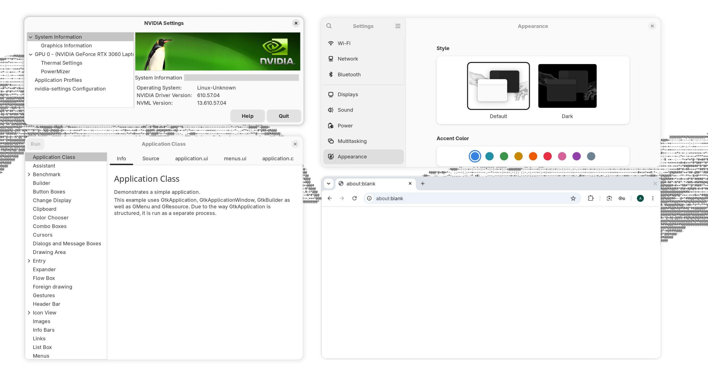
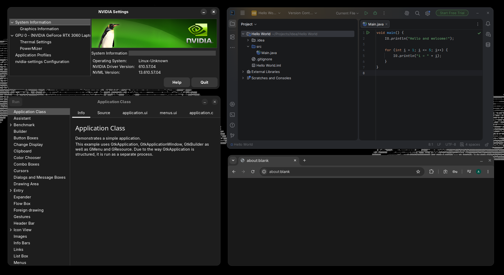

# Rounded Window Corners Native

Rounds every window to match libadwaita. Nothing to configure.

GNOME only rounds apps built with libadwaita. GTK3, Qt, Electron, Java and most terminals
stay square. This rounds them, using the radius, hairline and shadow from your real GTK
theme rather than from a settings page.

In the shots above, NVIDIA Settings and the GTK3 demo are GTK3, Chromium is on the right,
and the Settings window is libadwaita. That last one is never touched. The corners match
anyway.

Needs GNOME Shell 48, 49 or 50.

## Recommended themes

[adw-gtk3](https://github.com/lassekongo83/adw-gtk3) for GTK3 apps, or
[Monolith](https://github.com/ztrahmet/gnome-theme-monolith), a monochrome GTK and shell
theme for GNOME 48 and up that includes adw-gtk3.

## What it gets right

**No colour picker.** The values come from libadwaita's own stylesheet, or from your
custom GTK theme if you run one. Edit `~/.config/gtk-4.0/gtk.css` and it updates live.

**Light, dark and high contrast are not settings.** They are re-read from the theme, so
they are always what GNOME intended.

**Square when maximized or tiled.** Same as libadwaita. The effect is removed in those
states, not just hidden.

**Patches nothing.** No GNOME Shell method is overridden, so there is nothing to break on
the next release and nothing to fight with your dock or tiling extension.

**Cheap.** 27.8 microseconds per window per frame in the worst case, roughly 1% of a
frame. Idle windows cost nothing. Corners were checked against screenshots, not eyeballed:
15px renders at 15.0px, at 100%, 150% and 200% scaling.

## Compared to the others

[Rounded Window Corners](https://github.com/yilozt/rounded-window-corners) and
[Reborn](https://github.com/flexagoon/rounded-window-corners) came first, and this project
learned from both.

| | This | The others |
| --- | --- | --- |
| Border colour | from your theme | you pick it |
| Light / dark / contrast | automatic | one colour serves both |
| Shell methods patched | none | three |
| Actors per window | one effect | effect, shadow widget, constraints |
| Settings | none | radius, shadows, per-app rules, blacklists |

Use theirs if you want a 20px radius, squircles, or different corners for one app. This
one cannot do any of that on purpose.

Use this one if you would rather it match the rest of GNOME and never think about it.

## Docs

- [How it works](docs/how-it-works.md)
- [Development](docs/development.md)
- [Performance](docs/performance.md)

GPL-3.0-or-later.
